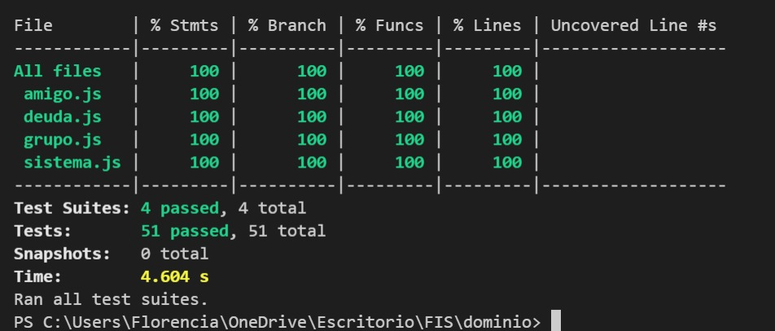

# Mis Gastos - Grupo 7

**Link al repositorio:**  [bessonart-pineyro-varela](https://github.com/ORT-FIS-202108/bessonart-pineyro-varela.git)

**Materia:** Fundamentos de Ingeniería de Software

**Profesor:** Alejandro Adorjan

**Grupo:** M4B

|Estudiante | Número de estudiante |
| ---------------- | -------------------- |
| Luca Bessonart   | 231764               |
| Sofía Piñeyro    | 243498               |
| Florencia Varela | 254005               |

## Presentaciones Individuales

#### Sofía Piñeyro - Validación y Verificación de Requerimientos

[Parrafo descriptivo del tema]

Link al material: [Validación y Verificación de Requerimientos](https://fism4b-2021.slack.com/archives/C02N6D26B42/p1637581423008900)

#### Florencia Varela - Material Design: Web Components

Los Material Design - Web components son bloques de construcción interactivos para crear una interfaz de usuario. Estos son componentes web mantenidos por Google que implementan Material Design. Junto con una guía de implementación, en el sitio de Material Design hay una serie de consejos de como utilizar los componentes de forma que respeten las 'guidelines' de UI y UX de Google.

Link al material: [Material Design - Web Components](https://fism4b-2021.slack.com/archives/C02N6D26B42/p1637581182008100)

#### Luca Bessonart -

## Construcción

### Casos de Uso implementados
#### Caso de uso 1.
**Título:** Registrar Amigo
**Curso normal:**
| Acción de los actores | Respuesta del sistema |
| --------------------- | --------------------- |
| **1.** Selecciona agregar amigo. | **2.** Le pide al usuario un nombre y un método de pago favorito. |
| **3.** Ingresa un nombre y un método de pago favorito. Selecciona "Agregar". | **4.** Se actualiza la lista de amigos en pantalla, mostrando el nuevo amigo agregado. |

**Cursos alternativos:**

**3.1** Si no se ingresa un nombre: se muestra un mensaje "Por favor, ingrese un nombre".

**3.2** Si ya existe un amigo con el nombre ingresado, se le indica al usuario que el amigo ya existe.

**3.3** El ususario selecciona cancelar. Fin del caso de uso.

#### Caso de uso 2.
**Título:** Eliminar Amigo
**Curso normal:**
| Acción de los actores | Respuesta del sistema |
| --------------------- | --------------------- |
| **1.** Selecciona eliminar amigo. | **2.** Le pide confirmacion al usuario. |
| **3.** Confirma la eliminacion del amigo. | **4.** Se actualiza la lista de amigos en pantalla, sin el amigo eliminado. |

**Cursos alternativos:**
**2.1** No hay ningun amigo ingresado: se le indica al usuario que no tiene ningún amigo. Fin del caso de uso 

**3.1** El ususario selecciona cancelar. Fin del caso de uso.

#### Caso de uso 3.
**Título:** Registrar Grupo

#### Caso de uso 4.
**Título:** Eliminar Grupo

#### Caso de uso 5.
**Título:** Registrar Deuda

#### Caso de uso 6.
**Título:** Saldar Deuda

### Configuración de plataforma tecnológica para desarrollo y producción

### Documentación del uso de librerías externas (package.json)

## Interfaz de usuario

Interfaz de usuario web / mobile (responsive)

Página única con navegación entre secciones

Implementación: Material Design Web Components

Aplicar un sistema de diseño y principios de usabilidad

Cumplimiento de estándar de accesibilidad WCAG

Seguir especificación de estilo

## Codificación

Para el proyecto todos los integrantes del equipo usamos la IDE Visual Studio Code. A esta le agregamos la siguente extención para manejar el análisis estático del código :

Name: ESLint
Id: dbaeumer.vscode-eslint
Description: Integrates ESLint JavaScript into VS Code.
Version: 2.2.2
Publisher: Microsoft
VS Marketplace Link: https://marketplace.visualstudio.com/items?itemName=dbaeumer.vscode-eslint 

- Estándares de codificación Google (HTML, CSS, JavaS)

Como buena práctica de OPP separamos la pare lógica de la interfaz. Se pueden ver dos carpetas: dominio donde se encuantra la lógica y los tests, y interfaz donde se entucentra el archivo html y dos sub-carpetas una con el css, y otra con la lógica del html.

## Test unitario

Cada clase dentro de la carpeta dominio tiene un test con su mismo nombre que prueba todas las funciones de esta. 
Buscamos con estos comprobar todos los metodos funcionen y detectar si hay código inaccesible, o si algún metodo no devuelve el valor esperado.

Como forma de comprobar lo anterior mencionado bucabamos un 100% de cobertura de las pruebas sobre el código.

## Test de sistema

Realizar test de sistema en un entorno separado del desarrollo

Generar casos de prueba aplicando técnica partición equivalente

Detallar sesiones de prueba exploratoria

## Reporte de issues

- Reportar issues (bugs, improvements, missing features) en GitHub 

- Aplicar buenas prácticas de reporte de issues

- Definir labels para tipos de issue y niveles de severidad

- Dejar issues abiertos para correcciones o mejoras futuras

- Sumarizar número de issues reportados por tipo

- Realizar una evaluación global de la calidad

## Reflexión
### Detalle del trabajo individual

#### Luca:

#### Sofía:

#### Florencia:

### Técnicas aplicadas y aprendizajes
