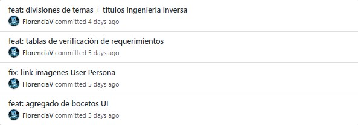

# Mis Gastos - Grupo 7

**Materia:** Fundamentos de Ingeniería de Software

**Profesor:** Alejandro Adorjan

**Grupo:** M4B

**Integrantes:**
- Luca Bessonart - 231764
- Sofía Piñeyro - 243498
- Florencia Varela - 254005
---
#### Link al repositorio: [bessonart-pineyro-varela](https://github.com/ORT-FIS-202108/bessonart-pineyro-varela.git)

---
## Glosario
- Usuario: dentro de este proyecto se considera usario al público que usará la aplicación, no como un usuario que requiere un login.
- Merge: fusionar dos ramas.
- Balancear: eliminar todas las deudas.
- Acreedor: persona a la que le deben dinero.
- Deudor: persona que debe dinero.

---
## Repositorio Git

### Creación y uso de repositorios locales y remotos
Un repositorio es una estructura de directorios en disco, donde se almacenan los elementos de software producidos a lo largo de todo un proyecto.
Git es el sistema de control de versiones distribuido más utilizado del mundo. Es un proyecto de código abierto maduro y con un mantenimiento activo que desarrolló originalmente Linus Torvalds en el año 2005.
GitHub es una plataforma de desarrollo colaborativo de software para alojar proyectos utilizando el sistema de control de versiones Git. GitHub aloja respositorios de código y brinda herramientas muy útiles para el trabajo en equipo.
Para este proyecto, se creó el repositorio en GitHub. Cada integrante del equipo trabajará en un repositorio local, que se mantendrá actualizado con el repositorio remoto.
### Comandos Git ejecutados desde terminal y desde el IDE
Los comandos de Git que utilizamos son los siguientes.

`git clon <repo url>`

Este comando se usa para crear una copia o clonar un repositorio remoto. Git es compatible con varios protocolos de red y sus formatos de URL correspondiente. 

`git pull <remoto> <rama>`

Este comando se emplea para extraer y descargar contenido desde un repositorio remoto y actualizar al instante el repositorio local para reflejar ese contenido, es decir, recupera las nuevas confirmaciones y las fusiona en una rama local.
`<remoto>` es el nombre del repositorio remoto, por lo general `origin`, y `<rama>` es el nombre de la rama local, por ejemplo `main`.
Notar que si hay cambios no confirmados, la fusión fallará y la rama local quedará intacta.

`git push <remoto> <rama>`

Este comando se usa para subir cambios realizados en una rama local a un repositorio remoto. Envía la rama especificada, junto con toos los commits y objetos internos necesarios, creando una rama local en el repositorio de destino.
Se puede usar `git push <remoto> --all` para enviar todas las ramas locales al repositorio remoto.  

`git status`

Este comando muestra el estado del directorio de trabajo y del área del entorno de ensayo. Permite ver los cambios que se han preparado, los que no y los archivos en los que Git no está realizando un seguimiento. 

`git log`

Este comando muestra las instantáneas confirmadas. Te permite ver el historial del proyecto, filtrarlo y buscar cambios concretos. 
Se puede personalizar de distintas maneras:
* `git log -n <limite>`, limita el número de confirmaciones que se muestran.
* `git log --oneline`, permite agrupar cada confirmación en una sola línea.
* `git log --stat`, incluye información sobre los archivos que se han modificado y el número relativo de líneas que se han añadido o eliminado en cada uno de ellos.
* `git log -p`, muestra la diferencia completa de cada confirmación.
* `git log --author="<nombre>"`, busca confirmaciones por un autor en concreto.
* `git log --grep="<patrón>"`, busca confirmaciones con un mensaje de confirmación que coincida con el patrón.
* `git log <archivo>`, muestra las confirmaciones que incluyen el archivo especificado.

`git add <file>`

Este comando añade un cambio del directorio de trabajo en el entorno de ensayo, indicando a Git que se quiere incluir actualizaciones en un archivo concreto en la próxima confirmación. 
Existen otras opciones para ejecutar este comando, como:

* `git add <directory>`, prepara todos los cambios de `<directory>`.
* `git add -A`, prepara todos los archivos que hay en el repositorio. Esto incluye archivos nuevos, modificados y eliminados. La opción `-A` es equivalente a `--all`.
* `git add .`, prepara los archivos nuevos y modificados, pero no los eliminados.
* `git add -u`, prepara los archivos modificados y eliminados, pero no los archivos nuevos.

Notar que `git add` no afecta al repositorio de manera significativa, los cambios no se registran hasta ejecutar `git commit`.

`git commit`

Las confirmaciones de cambios realizados se crean con este comando para capturar el estado de un proyecto en ese determinado momento. El comando abrirá un editor de texto pidiendo un mensaje para la confirmación. Una vez escrito el mensaje, guarda el archivo y cierra el editor para crear la confirmación.

Se puede utilizar un comando de atajo `git commit -m "mensaje"`, que crea inmediatamente una confirmación con el mensaje determinado. 

`git branch`

Este comando enumera todas las ramas que hay en un repositorio.
Existen otras opciones que permiten crear y eliminar ramas, así como cambiar su nombre. Estas son:
* `git branch <rama>`, crea una nueva rama llamada `<rama>`.
* `git branch -d <rama>`, elimina la rama especificada. Git evita que la rama se elimine si tiene cambios que no se han fusionado, por lo que es una operación segura.
* `git branch -D <rama>`, fuerza la eliminación de la rama especificada.
* `git branch -m <rama>`, cambia el nombre de la rama actual a `<rama>`.
* `git branch -a`, enumera todas las ramas remotas.

`git checkout <rama>`

Este comando permite cambiar a una rama específica ya existente. 
Acepta el argumento `-b <nueva rama>`, que permite crear una nueva rama y cambiar a ella al instante.

---
## Versionado
### Aplicar buenas prácticas de versionado
A partir del décimo commit empezamos a implementar el siguiente sistema de versionado, donde el mensaje del commit tiene la siguiente estructura:
1. **fix:** un commit del tipo `fix` arregla un bug del código.
2. **feat:** un commit del tipo `feat` introduce una nueva feature al código.
3. *types* además de `fix` y `feat` se pueden usar, por ejemplo, `build:`, `chore:`, `ci:`, `docs:`, `style:`, `refactor:`, `perf:`, `test:`, y otros.

Este sistema de versionado está basado en [Conventional Commits](https://www.conventionalcommits.org/en/v1.0.0/ "Conventional Commits").
### Uso de ramas separadas de 'main'
Utilizamos dos ramas principales, **Develop** y **Main**.

**Main:** Es la rama principal, en ella se mantiene una versión estable del código. 

**Develop:** Se utiliza para ir desarrollando la app. Permite que la rama main funcione correctamente aunque se estén realizando cambios en el código. Cuando el cambio (una mejora, una nueva funcionalidad, etc.) se haya implementado correctamente, se hará un merge de la rama develop a main.

Además, utilizamos la rama **Hotfix** para solucionar problemas y errores que surgen en la rama main.
### Resumen de commits y evolución del proyecto
Durante la evolución de este proyecto, se realizaron los commits a medida que se realizaba un nuevo cambio o una nueva feature. De esta forma, se logró organizar cada commit como un cambio particular e independiente, pudiendo ver claramente la evolución del proyecto commit a commit. 

Como evidencia de esto, se adjuntan algunos commits realizados. 

La evolución del proyecto se puede consultar en el [Repositorio](https://github.com/ORT-FIS-202108/bessonart-pineyro-varela "repositorio").

---
## Elicitación
Como forma de investigar lo que un posible usuario busca en una aplicación de gastos grupales, se utilizaron las siguientes técnicas de elicitación:
### Tormenta de Ideas
Una de las técnicas de elicitación utilizada fue la lluvia o tormenta de ideas. Esta técnica permite liberar la creatividad de los equipos, generando un número extenso de ideas. Se obtuvo la siguiente lista de posibles funciones.
- Ingresar nombre de usuario, para personalizar los mensajes a mostrar.
- Elegir foto de perfil, de una lista predefinida.
- Ingresar preferencias, p.e. medio de pago favorito.
- Registrar gastos personales.
- Ingresar lista de amigos.
- Registrar un nuevo amigo.
- Crear grupos entre distintos usuarios.
- Registrar gastos grupales.
- Editar gasto grupal.
- Borrar gasto personal.
- Borrar gasto grupal.
- Balancear.
- Pagar deuda.
- Consultar preferencias de un amigo.
- Consultar deudas en grupos.
- Consultar historial de gastos personales.
- Consultar historial de gastos grupales.
### Entrevista a Profesional
El fin de realizar una entrevista profesional fue obtener cuales técnicas de elicitación son las más usadas actualmente en el área de desarollo de aplicaciones. Para así poder definir cuales técnicas utlizar en nuestro proyecto.
Se entervistó a Paola Biatturi, por su experencia en desarollo de frontend para 2 aplicaciones. Una aplicación fue para la empresa "flightcenter" esta fue la aplicación más grande de las 2 y su propocito era para uso interno de la empresa; tomó un total de un mes y una semana para completar el desarollo. Para esta app se utilizó el método de encuesta, de la cual participaron los disversos empleados que luego iban a usar la app. Luego se realizaron múltiples entrevistas a empleados de distintas áreas para escuchar propuestas y por último focus groups para testear los distintos prototipos y recibir feedback sobre el UI. 
La segunda app fue diseñada para venta a clientes de sabre. En este caso utlizó el método de las entrevistas para conocer si los clientes deseaban alguna funcionalidad específica y luego desarlló la app basandonse en sus experenica con clientes a lo largo de su carrera. El UI no fue testado con los clientes, solo de manera interna durante el desarollo.  

### Entrevistas
Esta técnica consiste en realizar entrevistas a distintos tipos de usuarios. En este caso, seleccionamos cuatro jóvenes de 19, 20 y 23 años. Con las entrevistas buscamos recolectar información sobre los requisitos de la aplicación, y si los entrevistados se ven interesados en el concepto de ésta. 

Durante las entrevistas realizadas, se buscó obtener respuestas principalmente sobre qué tan útil creían que es la aplicación, qué funcionalidades en particular les gustaría que tuviese, qué opinaban sobre una función que ayude al ahorro, y si creían que los grupos deberían ser con objetivos o generales. Desde luego, cada entrevista fue personal y única, y siguió su propio hilo, por lo que se logró obtener respuestas exclusivas y distintas en cada caso.

Una de las entrevistadas fue Isabella, estudiante de Medicina de 20 años. Tiene varios grupos de amigos y realiza todos los veranos un viaje con sus dos amigas más cercanas. Ella se mostró interesada en la idea, comentando que no conocía ninguna aplicación que gestionara los gastos de un grupo. Le pareció ideal para grupos de viajes o para personas que alquilan un apartamento juntas. Nos comentó algunas funcionalidades que le gustaría que tuviera la aplicación. Primero, la posibilidad de acceder al historial de compras del grupo, pudiendo filtrar por personas, y segundo, fijar un monto de gasto para un equipo bajo un concepto. Por ejemplo, dentro de un grupo hay subdivisiones de comida y se fija un límite para esos gastos de comida en conjunto y cuando se está por superar ese límite se le notifica al usuario. 

La segunda entrevista realizada fue a Lucía, una estudiante avanzada de Licenciatura en Comunicación de 23 años. La mayoría de sus gastos son personales, sin embargo, suele juntarse con sus grupos de amigos todas las semanas. Se mostró entusiasmada con la idea porque con sus amigas, con quienes comparte gastos usualmente, tenían la necesidad de una aplicación que volviera la tarea más fácil. Comentó que sus gastos suelen pertenecer a las categorías de entretenimiento, salud y bienestar, comida, transporte e indumentaria. Sugirió que se agregué una funcionalidad dentro de los grupos donde se pueda especificar si un gasto corresponde a una parte del grupo solamente. Por ejemplo, Lucía comentaba que cuando se junta con sus amigas a merendar, suelen comprar la merienda todas juntas pero paga una sola persona. Si cada una compra algo para tomar distinto, si bien la comida se divide entre todas, las deudas serán distintas, dependiendo del gasto de la bebida de cada una.

La tercera entrevista realizada fue a Mauro, un estudiante de UTU de informática, de 19 años. La mayoría de sus gastos corresponden a salidas con amigos, comida y transporte. Se mostró interesado en la idea, ya que realiza muchos gastos en conjunto con amigos. Comentó que le gustaría poder especificar el método de pago que utilizó cada persona, y sugirió agregar una funcionalidad que permita, dentro de un grupo, crear subgrupos más pequeños, para aquellas veces en que se juntan menos personas. Por último, planteó que cuando se junta con amigos, prefiere recolectar el dinero al principio (tener un fondo común), y luego pagar para evitar las deudas.

La última entrevista realizada fue a Santiago, también de 19 años, que actualmente está realizando un curso de Comercio Exterior. Sus gastos principales los divide en dos categorías: mensuales (e.g. gimnasio) y salidas con amigos (e.g. entretenimiento y comida). A pesar de tener gastos grupales frecuentemente, Santiago no encontró gran utilidad en la aplicación, pero sí para gestionar sus gastos personales. De esta forma, utilizaría la app mayoritariamente en su funcionalidad personal, dejando la gestión de gastos grupales como una funcionalidad extra. Además, sugirió una funcionalidad que permita distribuir distintos gastos de un evento, reduciendo las deudas. Por ejemplo, en un asado, se registran todas las compras necesarias (bebida, picada, carne, etc.), y luego la app asigna quién compra cada cosa, y luego genera las deudas correspondientes para que todos paguen lo mismo.

### Encuestas
Las encuestas son una forma de "entrevistar" a grandes grupos para comprender sus necesidades. No tiene tanto alcance como las entrevistas a la hora de obtener opiniones bien fundamentadas, pero da una perspectiva de que buscaría un gran grupo de posibles usuarios en una aplicación de gestión de gastos grupales.

Esta encuesta en particular fue realizada a personas en su mayoría (91.2%) de edades entre 18 y 25 años. Se pudo observar que solo un 21% de los encuestados utilizan una app para gestionar sus gastos personales, y tan solo un 12% utiliza una app para gestionar gastos grupales. Sin embargo, un 65% de los encuestados opinan que usarían una app para registrar gastos grupales en conjunto con sus grupos de amigos.

Los encuestados que sí utilizan alguna app para gestionar sus gastos, encuentran que las funcionalidades más utiles son:
* Poder consultar cuánto se gasto y en qué, para una buena gestión del dinero.
* Dentro de cada grupo, cada persona puede agregar cuánto gastó y en qué, sin tener un "encargado" del grupo.
* Relizar un cálculo automático de las deudas entre las distintas personas del grupo, y que se muestre de forma clara quién le debe cuánto a quién.

Por último, se observó que las categorías de gastos grupales más comunes son:
1. Salidas (Bares, Restaurantes, Cervecerías, Bailes, etc.)
2. Comida
3. Entretenimiento (entradas, aplicaciones como Netflix, etc.)
4. Viajes (pasajes, entradas a atracciones turísticas, etc.)
5. Consumos Básicos (agua, luz, teléfono, etc.)
6. Alquileres (Casa, auto, etc.)

### Ingeniería Inversa
La ingeniería inversa es una técnica de elicitación independiente que implica examinar otras aplicaciones de gestión de gastos. Al realizar esto, se puede observar qué funcionalidades se repiten y son útiles.
Investigamos varias apps que se enfocan en la gestión de gastos personales. En particular, realizamos ingeniería inversa sobre dos aplicaciones Settle Up y Splitwise.
#### Conclusiones de ingeniería inversa de Settle Up
- Se puede crear un grupo.
- Dentro de cada grupo se muestran las compras realizadas y las deudas a saldar.
- Se puede saldar una deuda.
- Se puede ver un historial de las compras del grupo.
- Al ingresar una deuda dentro de un grupo se puede seleccionar los participante, por lo tanto no todos los integrantes de un grupo deben obligatoriamente participar de todas las compras.
- Al ingresar una compra, se le pide al usuario el encargado de la compra, el monto, la fecha de la compra, una descripción, quienes participaron de la compra y en que proporción.
- Permite enviarle un mail a los miembros del grupo con las deudas pendiente del grupo.
- Eliminar amigo de un grupo.
#### Conclusiones de ingeniería inversa de Splitwise
- Los grupos pueden tener conceptos predeterminados, por ejemplo: viaje, pareja, roomates, etc..
- Se permite poner una foto de perfil al grupo.
- Se le permite al usuario hacer un grupo consigo mismo.
- Dentro de cada grupo se muestran gráficos con información sobre la deudas y las compras.
- Permite escanear recibos.

### Evidencia de actividades de investigación
No se grabaron las entrevistas por inconvenientes con programas de grabacion y porque algunos de los entrevistados solicitaron no ser grabados. Solo quedaron registrados los apuntes presentes en la seccion de entrevistas.
### Referencias a fuentes de información
- [Link a Splitwise](https://https://play.google.com/store/apps/details?id=com.Splitwise.SplitwiseMobile&hl=en&gl=US)
- [Link a Settle Up](https://play.google.com/store/apps/details?id=cz.destil.settleup&hl=en&gl=US)
---
### Caracterización de usuarios: User Personas
#### User Persona 1.

#### User Persona 2.

### Modelo conceptual del problema

---
## Especificación
### Definición de requerimientos funcionales y no funcionales
Como forma de estandarizar los requerimientos se definió una forma de identificación que consiste en el tipo de requerimiento seguido de un número. Para cada requerimiento se especifica una breve descripción y una prioridad (Alta, Media o Baja).
### Requerimientos Funcionales
Los requerimientos funcionales especifican servicios o funciones del sistema. Describen el comportamiento del sistema en ciertas condiciones, y las posibles tareas de los usuarios.
Dentro de los requerimientos funcionales el actor siempre será el usuario (ver glosario).

#### RF1: Registro de gasto personal

**Origen:** Tormenta de ideas

**Descripción:**  El sistema debe contar con una funcionalidad que permita a los usuarios registrar un gasto personal. Se le debe de pedir al usuario el monto, la moneda y la descripción del gasto. Se le debe dar al usuario la opción de cancelar en cualquier instancia del registro.

**Prioridad:** Alta

#### RF2: Borrar gasto personal

**Origen:** Tormenta de ideas

**Descripción:** El sistema debe contar con una funcionalidad que permita al usuario borrar un gasto personal. El usuario debe elegir el gasto a borrar. Se le debe pedir al usuario confirmar la acción.

**Prioridad:** Alta

#### RF3: Registro de gasto grupal

**Origen:** Tormenta de ideas - Ingeniería Inversa

**Descripción:** El sistema debe contar con una funcionalidad que permita al usuario registrar un gasto grupal. El usuario debe poder elegir, dentro del grupo, quiénes pagaron y para quiénes se realizó el gasto. Se le debe pedir al usuario el monto, la moneda y una descripción; se le debe dar la opción al usuario de cambiar la proporción de distribuición de la compra (predeterminadamente equitativa). Se le debe dar al usuario la opción de cancelar en cualquier instancia del registro.

**Prioridad:** Alta

#### RF4: Borrar gasto grupal

**Origen:** Tormenta de ideas

**Descripción:** El sistema debe contar con una funcionalidad que permita al usuario borrar un gasto grupal. El usuario deberá elegir el gasto a borrar. Se le debe pedir al usuario confirmar la acción.

**Prioridad:** Alta

#### RF5: Editar gasto grupal

**Origen:** Tormenta de ideas

**Descripción:** El sistema debe contar con una funcionalidad que permita al usuario editar un gasto grupal. El usuario debe elegir el gasto a editar. Se le debe permitir al usuario modificar el monto y la descripción. No se le debe permitir al usuario modificar la moneda.

**Prioridad:** Baja

#### RF6: Crear grupo

**Origen:** Tormenta de ideas - Ingeniería Inversa

**Descripción:** El sistema debe contar con una funcionalidad que permita al usuario crear un grupo. El usuario deberá seleccionar los amigos (previamente registrados) de una lista y asignarle un nombre al grupo.

**Prioridad:** Alta

#### RF7: No deber haber login

**Origen:** Tormenta de ideas - Letra

**Descripción:** El sistema no debe pedirle al usuario ningún tipo de login. No se le debe solicitar ningún dato personal.

**Prioridad:** Alta

#### RF8: Registrar amigo

**Origen:** Tormenta de ideas

**Descripción:** El sistema debe contar con la funcionalidad de agregar un amigo. Se le debe pedir al usuario el nombre y la preferencia de pago.

**Prioridad:** Alta

#### RF9: Eliminar amigo de un grupo

**Origen:** Ingeniería inversa

**Descripción:** El sistema debe contar con la funcionalidad de eliminar a un amigo de un grupo. Solo debe de permitírsele al usuario eliminar a un amigo si su deuda con cualquier integrante del grupo es 0(cero). Se le debe pedir al usuario confirmar la acción.

**Prioridad:** Media

#### RF10: Eliminar amigo

**Origen:** Tormenta de ideas

**Descripción:** El sistema debe contar con la funcionalidad de eliminar a un amigo. Se le debe pedir al usuario confirmar la acción.

**Prioridad:** Alta 

#### RF11 Pagar deuda

**Origen:** Tormenta de ideas

**Descripción:** El sistema debe contar con la funcionalidad de pagar las deudas de un grupo. El usuario debe especificar el monto a pagar y se debe verificar que este no sea mayor a la deuda.

**Prioridad:** Alta

#### RF12: Consultar historial de gastos personales

**Origen:** Tormenta de ideas

**Descripción:** El sistema debe contar con la funcionalidad de consultar el historial de gastos personales. El usuario debe poder filtrar por antigüedad.

**Prioridad:** Baja

#### RF13: Consultar historial de gastos grupales

**Origen:** Entrevista - Ingeniería inversa

**Descripción:** El sistema debe contar con la funcionalidad de consultar el historial de gastos grupales. El usuario debe poder filtrar por antigüedad, amigo a cargo del gasto, o por monto.

**Prioridad:** Media

#### RF14 Consultar Deudas

**Origen:** Tormenta de ideas

**Descripción:** El sistema debe contar con la funcionalidad de visualizar las deudas dentro un grupo

**Prioridad:** Alta

#### RF15 Balancear

**Origen:** Tormenta de ideas

**Descripción:** El sistema debe gestionar quién le debe pagar cuánto a quién, de tal forma que se realicen la menor cantidad de pagos posibles. 

**Prioridad:** Alta
---
### Requerimientos Funcionales
| Identificación | Descripción                                                      | Prioridad |
| -------------- |:---------------------------------------------------------------- | --------- |
| RNF1           | Primary Color: Deep Purple 700.                                  | Alta      |
| RNF2           | Secondary Color: Teal 700.                                       | Alta      |
| RNF3           | Font: Roboto.                                                    | Alta      |
| RNF4           | Icons: filled.                                                   | Alta      |
| RNF5           | El sistema deberá funcionar en Android 12.                       | Alta      |
| RNF6           | Implementar el uso de "Chips" para la descripción de los gastos. | Baja      |
| RNF7			 | La aplicación debe de llevar el nombre de MisGastos.				| Alta		|
---
### User Stories
Las user stories describen una funcionalidad simple del sistema. Se trata de una explicación general para discutir el valor que provee el sistema a distintos interesados.

#### ID: #1
**Título:** Registrar gasto personal

**Narrativa:** 
  
**Como** usuario 
    
**Quiero poder** registrar un nuevo gasto personal
   
**Para** guardarlo en el sistema.

**Criterios de aceptación:** 
 * se registra en el sistema un nuevo gasto con su monto, moneda y descripción.

#### ID: #2
**Título:** Registrar amigo

**Narrativa:** 
  
**Como** usuario 
    
**Quiero poder** ingresar el nombre y la preferencia de pago de un nuevo amigo
   
**Para** registrarlo en el sistema y luego unirlo a grupos.

**Criterios de aceptación:** 
 * se registra en el sistema un nuevo amigo con su nombre y preferencia de pago.

#### ID: #3
**Título:** Eliminar amigo de un grupo

**Narrativa:** 
  
**Como** usuario 
    
**Quiero poder** seleccionar un amigo dentro de un grupo
   
**Para** eliminarlo de dicho grupo.

**Criterios de aceptación:** 
 * el amigo eliminado ya no pertenece al grupo.

#### ID: #4
**Título:** Eliminar amigo

**Narrativa:** 
  
**Como** usuario 
    
**Quiero poder** seleccionar un amigo de una lista con todos mis amigos
   
**Para** eliminar al amigo seleccionado de mis amigos.

**Criterios de aceptación:** 
 * el amigo eliminado ya no pertenece a mis amigos, y toda referencia a él es eliminada, (excepto de los historiales).

### Use Cases
#### Caso de uso 1.

**Título:** Registrar gasto personal

**Actor:** Usuario

**Referencia:** RF1

**Curso normal:**
| Acción de los actores | Respuesta del sistema |
| --------------------- | --------------------- |
| **1.** Selecciona "Nuevo gasto personal" | **2.** Muestra una caja de texto para ingresar números y una lista de tipos de moneda (pesos, dólares, reales, euros, otro). |
| **3.** Ingresa el monto (número mayor a 0) y selecciona el tipo de moneda | **4.** Muestra una caja de texto y sugerencias |
| **5.** Ingresa la descripción, que debe ser menor a 40 caracteres | **6.** Muestra todos los datos ingresados en pantalla y pide una confirmación|
| **7.** Confirma los datos | **8.** Se registra el nuevo gasto|

**Cursos alternativos:**

**3.1** Si el monto es menor a 0: se muestra un mensaje "El monto debe ser mayor a 0".

**3.2** Si no se ingresa un monto: se muestra un mensaje "Por favor, ingrese un monto".

**3.3** Si no se selecciona el tipo de moneda: se muestra un mensaje "Por favor, seleccione el tipo de moneda".

**5.1** Si la descripción es mayor a 40 caracteres: se muestra un mensaje "La descripción debe ser menor a 40 caracteres".

**5.2** Si no se ingresa una descripción: se muestra un mensaje "Por favor, ingrese una descripción".

**7.1** Si no confirma los datos (selecciona cancelar o cerrar): fin caso de uso.

#### Caso de uso 2.
**Título:** Crear un grupo de amigos

**Actor:** Usuario

**Referencia:** RF6

**Curso normal:**
| Acción de los actores | Respuesta del sistema |
| --------------------- | --------------------- |
| **1.** Selecciona "Nuevo grupo de amigos" | **2.** Muestra una lista con los amigos ya registrados |
| **3.** Selecciona uno o más amigos | **4.** Pide que se ingrese un nombre para el grupo  |
| **5.** Ingresa el nombre del grupo, que es un string de letras únicamente | **6.** Muestra los datos ingresados y pide confirmación |
| **7.** Confirma los datos | **8.** Crea el grupo |

**Cursos alternativos:**

**2.1** Si no hay amigos ingresados: Muestra un mensaje "Debes ingresar a tus amigos primero para crear un grupo".

**3.1** Si no se selecciona ningún amigo: se muestra un mensaje "Debes seleccionar al menos un amigo".

**5.1** Si no se ingresa un nombre: se muestra un mensaje "Por favor, ingrese un nombre".

**5.2** Si el nombre ingresado es incorrecto: se muestra un mensaje "El nombre debe contener letras únicamente. Por favor, reingrese".

**7.1** Si no confirma los datos (selecciona cancelar o cerrar): fin caso de uso.

#### Caso de uso 3.
**Título:** Pagar deuda

**Actor:** Usuario

**Referencia:** RF14 y RF11

**Curso normal:**
| Acción de los actores | Respuesta del sistema |
| --------------------- | --------------------- |
| **1.** Dentro de un grupo, selecciona la opción "Ver deudas"  | **2.** Muestra todas las deudas que hay en el grupo |
| **3.** Selecciona una de las deudas de la lista | **4.** Muestra el monto total y solicita que se ingrese el monto a pagar |
| **5.** Ingresa monto a pagar (número entre 1 y el monto total)| **6.** Muestra los datos de la deuda a cancelar (monto ingresado, monto restante, personas involucradas) y pide confirmación |
| **7.** Confirma los datos | **8.** Actualiza la deuda con el monto restante |
**Cursos alternativos:**

**2.1** Si no hay deudas: Muestra un mensaje "No hay deudas pendientes".

**3.1** Si no se selecciona ninguna deuda: se muestra un mensaje "Debes seleccionar una deuda".

**5.1** Si no se ingresa un monto: se muestra un mensaje "Por favor, ingrese un monto".

**5.2** Si el monto ingresado es incorrecto: se muestra un mensaje "El monto debe ser mayor a 0 y menor al monto total. Por favor, reingrese".

**7.1** Si no confirma los datos (selecciona cancelar o cerrar): fin caso de uso.

**8.1** Si el monto restante es igual a 0: la deuda es eliminada.

### Bocetos de IU
Prototipo: [Link al prototipo](https://www.figma.com/proto/lgVU9pjV62HU5Ybg9OlCT4/FIS?page-id=0%3A1&node-id=17%3A880&viewport=241%2C48%2C0.35&scaling=scale-down)

Menú:

---
## Validación y verificación
### Verificar la especificación
Como forma de verificar internamente que vamos por el camino correcto para construir el producto adecuado, realizamos una evaluación de los requisitos funcionales mediante una checklist. Nos preguntamos si cada requisito era viable (factible de ser hecho), consistente (no se contradice con otro), preciso y no ambiguo, verificable, si estaba priorizado correctamente y si se identificaba claramente su origen.

### Validar la solución con personas no involucradas en el proyecto
La validación se realizó con dos posibles usuarios. En primer lugar, Isabella (misma persona con la que realizamos una de las entrevistas iniciales), de 20 años, estudiante de medicina con varios grupos de amigos distintos y un grupo con el cual viaja todos los veranos. Y ...

La validación con Isabella fue positiva, quedó conforme en términos generales, pero hizo alguna recomendaciones a tener en cuenta. Opinó que si el objetivo es gestionar gastos dentro de grupos de amigos, la parte de gastos personales, si bien es útil, no corresponde. También comentó la posibilidad de agregar dos funcionalidades. La primera es asignarle a cada amigo un número de teléfono o mail, con el fin de poder recordarles sus deudas. La segunda es definir gastos constantes (mensuales, semanales), para que no sea necesario ingresarlo todos los meses o semanas.

---
## Reflexión
### Detalle del trabajo individual

#### Luca:
#### Sofía:
#### Florencia:
En aspectos generales, el proyecto fue interesante por las herramientas utilizadas y los conceptos aplicados. Me resultó interesante aprender sobre las técnicas y herramientas que se utilizan actualmente y poder ponerlas en práctica. Pero hubiera estado bueno que nos dieran un poco más de base para el trabajo en equipo en el área profesional. 

La temática me resultó un poco aburrida, y la letra un poco confusa. Esta no especificaba bien que se pedía en la entrega, solo daba unos títulos un tanto abstractos sobre las secciones del documento a entregar. La temática de “MisGastos” me resulto un poco limitante, por lo que con el grupo decidimos darle una perspectiva más grupal, en el sentido de “mis gastos dentro de un grupo y la gestión de estos”. 

El proyecto lo realizamos en buenos tiempo y en general el avance fue bastante constante. Hubo algunos problemas de comunicación entre nosotros, que se hubieran resulto más rápido y mejor si nos hubiésemos sentado a plantear concretamente nuestras ideas del proyecto. Y si todos hubiésemos avanzado al mismo ritmo y simultáneamente, pero por situaciones de evaluaciones de otras materias fue difícil. 

Al comienzo nos habíamos dividido las tareas a medida que avanzábamos, pero rápidamente nos dimos cuenta de que no era efectivo, por lo que todos aportamos en todas las áreas en distintas medidas. La única tarea en la que participé solo yo fue el armado de los bocetos de UI en la herramienta Figma, esto se debió a que tengo una amiga que estudia diseño gráfico y me dio algunos consejos para el uso de la herramienta. Igualmente antes de agregarlos al proyecto fueron aprobados por el resto de los integrantes.

### Técnicas aplicadas y aprendizajes
En general para el proyecto nos desempeñamos como un buen equipo. Nos dividimos las tareas y pudimos avanzar de forma constante y en conjunto. Ya avanzado el proyecto, surgieron algunos inconvenientes que nos llevaron a no cumplir con los tiempos que nos habíamos establecido en un comienzo.

El mayor inconveniente que tuvimos fue una falta de comunicación sobre la idea general del proyecto. Ya avanzado en este, nos percatamos que los conceptos que teníamos de la función balancear eran completamente distintos. Eso generó que se cambiaran completamente partes importantes del proyecto, como algunos requerimientos funcionales y un caso de uso.

Otro obstáculo que se nos presentó, en este caso de forma constante durante todo el proyecto, fue la adaptación a los formatos de commit. Éstos los establecimos con la idea de simplificar la lectura de los commits y poder ver claramente el avance, pero a la hora de poner en práctica estos formatos, nos surgieron problemas. Al comienzo nos olvidábamos de hacerlos en el formato correcto y luego si uno de nosotros hacia muchos cambios debía poner una descripción muy extensa al commit y se desviaba de la forma planteada originalmente.

Al iniciar el proyecto, habíamos divido las tareas de forma que cada uno hiciera una y luego se iba a revisar en conjunto y se aprobaban y se hacía el merge con la rama main. Eso en la práctica no nos resultó tan cómodo, por lo que, al final, terminamos todos participando de todas las partes y haciendo cambios en las mismas secciones en simultáneo, lo que trajo algunos choques entre versiones.

---
## Bibliografía
[¿Qué es Git?](https://www.atlassian.com/es/git/tutorials/what-is-git "¿Qué es Git? Atlassian Git Tutorial")

[¿Qué es Github?](https://conociendogithub.readthedocs.io/en/latest/data/introduccion/ "Conociendo GitHub")

[Tutoriales de Git y comandos](https://www.atlassian.com/es/git/tutorials "Tutoriales de Git")

[Markdown Cheatsheet](https://github.com/adam-p/markdown-here/wiki/Markdown-Cheatsheet "Markdown Cheatsheet")