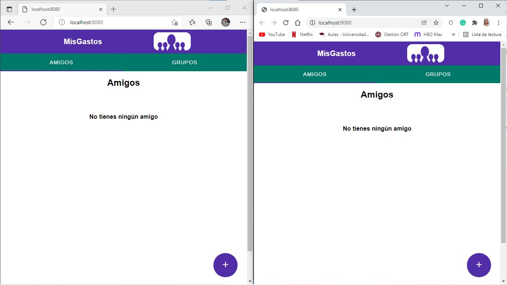
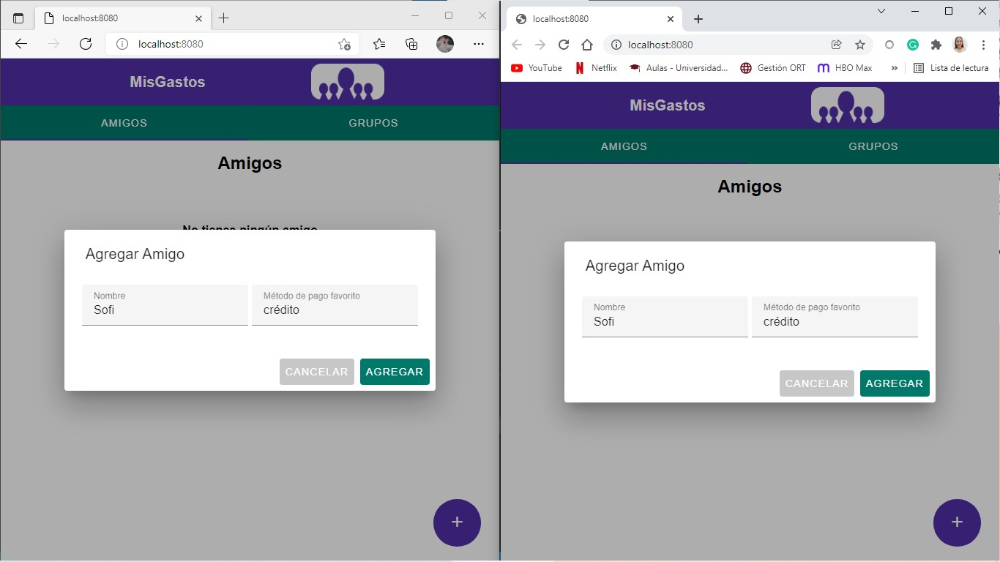
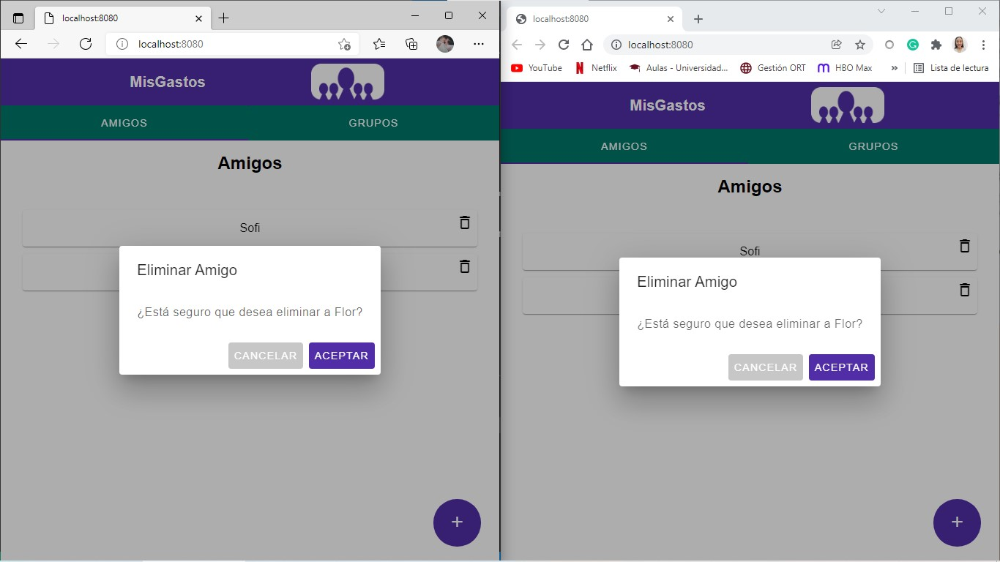
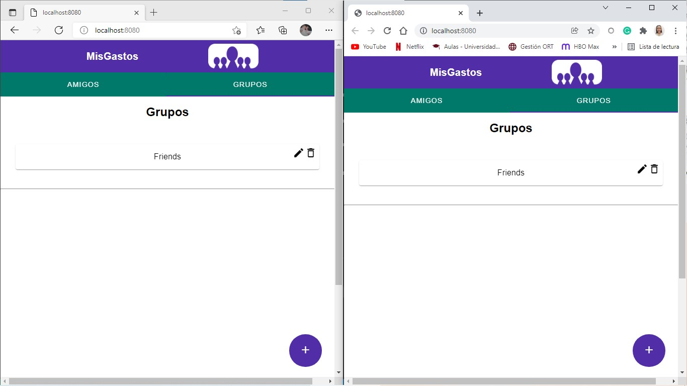
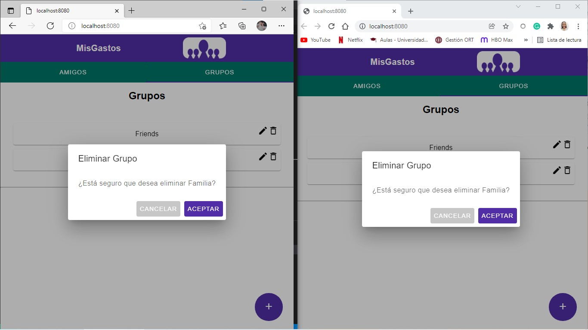
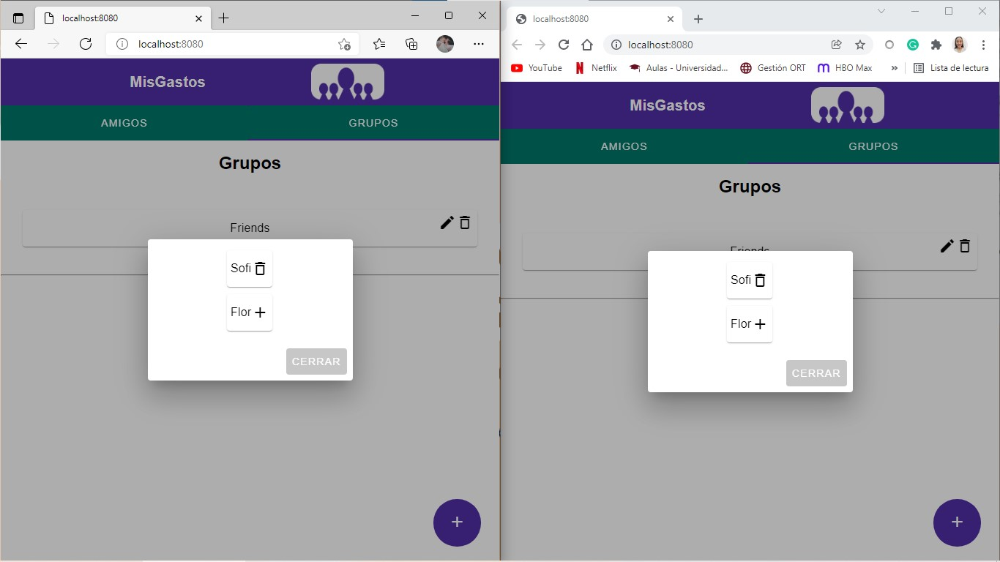
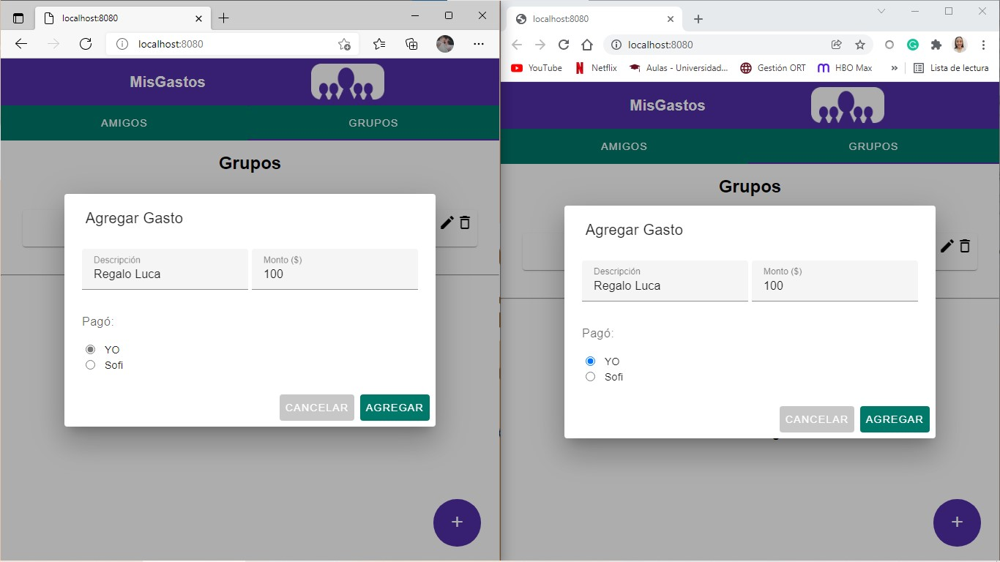
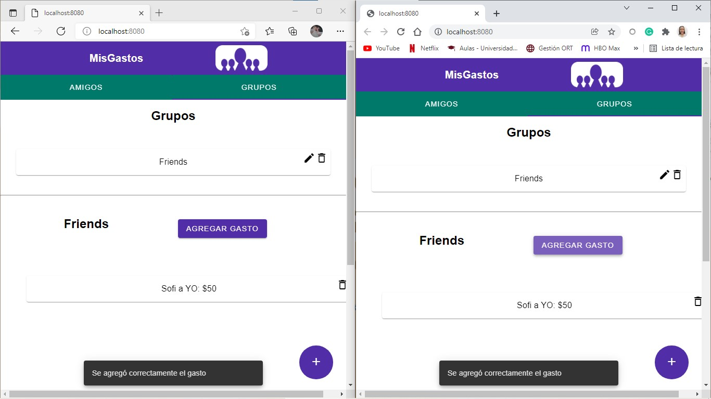
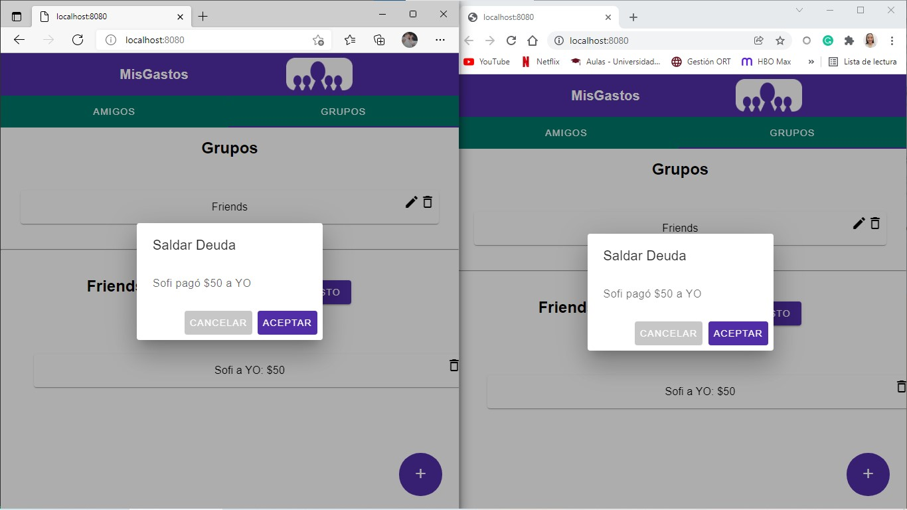

# Sesión de Testing Exploratorio
## MISION
Validar que el comportamiento de la aplicación sea igual en Microsoft Edge y Google Chrome. |

### INICIO 
29/11/2021 - 19:00 pm
### TESTER
Sofía Piñeyro
### ESTRUCTURA DE DIVISIÓN
**DURACIÓN:** Corta (30 min) 

**CONFIGURACIÓN DE LA SESIÓN:** 10%

**DISEÑO Y EJECUCIÓN DE PRUEBAS:** 57% 

**INVESTIGACIÓN Y REPORTE DE DEFECTOS:** 33% 

**OPORTUNIDAD vs MISIÓN:** 10/90

### NOTAS DE PRUEBA 
**Prueba 1 - Abrir la página de inicio**
- Abrir localhost:8080 en Microsoft Edge y Google Chrome
- Se muestra la página de Amigos
Estado: Pasa

**Prueba 2 - Agregar amigo**
- Seleccionar '+'
- Ingresar datos de un nuevo amigo (se probó no completar todos los campos)
- Seleccionar 'Agregar'
- Se actualiza la lista de amigos
Estado: Pasa

**Prueba 3 - Eliminar amigo**
- Seleccionar la basura de un amigo
- Muestra un diálogo pidiendo la confirmación
- Seleccionar 'Aceptar'(se probó también seleccionar 'Cancelar')
- Se actualiza la lista de amigos
Estado: Pasa

**Prueba 4 - Agregar grupo**
- Seleccionar la pestaña Grupos
- Seleccionar '+'
- Ingresar nombre del grupo (se probó no completar todos los campos)
- Seleccionar 'Agregar'
- Se actualiza la lista de grupos
Estado: Pasa

**Prueba 5 - Eliminar grupo**
- Seleccionar la basura de un grupo
- Muestra un diálogo pidiendo la confirmación
- Seleccionar 'Aceptar'(se probó también seleccionar 'Cancelar')
- Se actualiza la lista de grupos
Estado: Pasa

**Prueba 6 - Editar grupo**
- Seleccionar el lápiz de un Grupo
- Seleccionar '+' para cada integrante que se quiere agregar
- Seleccionar 'Cerrar'
- Seleccionar nuevamente el lápiz
- Notar que a los integrantes agregados se les cambió el '+' por una basura
Estado: Pasa

**Prueba 7 - Agregar Gasto**
- Seleccionar un grupo
- Seleccionar 'Agregar Gasto'  
- Ingresar descripción, monto y seleccionar responsable del pago (se probó también no completar todos los campos)
- Seleccionar 'Agregar'
- Se actualiza la lista de deudas
Estado: Pasa

**Prueba 8 - Saldar Deuda**
- Seleccionar un grupo
- Seleccionar la basura de una de las deudas
- Muestra un diálogo pidiendo confirmación
- Selecciona 'Aceptar' (se probó también seleccionar 'Cancelar')
- Se actualiza la lista de deudas
Estado: Pasa

### DEFECTOS
No se encontraron defectos, ya que en ambos navegadores las interfaces se veían iguales e interactuaban de la misma forma.

### INCONVENIENTES
No hubo inconvenientes.
